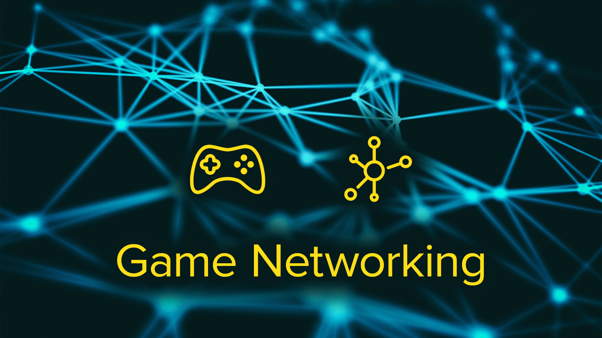

# Awesome Game Networking 

> A Curated List of Game Network Programming Resources

Game networking is a subset of computer networking that specifically covers data replication, state synchronization and RPCs for multiplayer online games. Entity interpolation, input prediction, lag compensation and client-server model topics are main pillars of gameplay network development. This list contains handfully picked resources ranging between high-level network architectures and low-level data replication optimizations.

## Contents

- [Articles](#articles)
- [Talks](#talks)
- [Tutorials](#tutorials)
- [Libraries](#libraries)
- [Projects](#projects)

## Articles

- [The DOOM III Network Architecture](http://mrelusive.com/publications/papers/The-DOOM-III-Network-Architecture.pdf) - Architecture improves upon previous network architectures used in the Quake III Arena
- [Ethernet vs. WiFi](https://na.leagueoflegends.com/en/page/ethernet-vs-wifi-ping-packets-playing-better) - Internet connection over WiFi vs Ethernet metrics comparison by Viscarious from Riot Games.
- [Fast-Paced Multiplayer](http://www.gabrielgambetta.com/client-server-game-architecture.html) - Gabriel Gambetta's client-side prediction, entity interpolation and lag compensation articles.
- [Gaffer on Games](https://gafferongames.com/) - Glenn Fiedler's reliable-UDP protocol and game network development articles.
- [Game Server Architecture](https://gameserverarchitecture.com/) - Matthew Walker's multiplayer game server architecture blog.
- [High Performance Browser Networking](https://hpbn.co/) - A fantastic free online book about modern web protocols by Ilya Grigorik.
- [How a Shooter Shoots](https://kotaku.com/5869564/networking-how-a-shooter-shoots) - Armin Ronacher's analysis on Battlefield 3's shooting mechanism in multiplayer.
- [IT Hare on Network Programming](http://ithare.com/category/network-programming/) - Detailed network programming articles from IT Hare team.
- [NAT Punch-through for Multiplayer Games](https://keithjohnston.wordpress.com/2014/02/17/nat-punch-through-for-multiplayer-games/) - Brief summary of NAT and P2P connectivity for games by Keith Johnston.
- [Networked Physics in Virtual Reality](https://developer.oculus.com/blog/networked-physics-in-virtual-reality-networking-a-stack-of-cubes-with-unity-and-physx/) - Networking a stack of cubes with Unity and PhysX by Glenn Fiedler at Oculus.
- [Network Protocols](https://www.destroyallsoftware.com/compendium/network-protocols?share_key=97d3ba4c24d21147) - A brief yet detailed overview of low-level network protocols stack from Destroy All Software.
- [Quake 3 Network Model](http://fabiensanglard.net/quake3/network.php) - Fabien Sanglard's source code review about Quake 3's networking model.
- [Real Time Multiplayer in HTML5](http://buildnewgames.com/real-time-multiplayer/) - Sven Bergström's multiplayer game development guide using web technologies.
- [Replication in Networked Games](https://0fps.net/2014/02/10/replication-in-networked-games-overview-part-1/) - Mikola Lysenko's replication articles for JavaScript-based multiplayer games.
- [Source Multiplayer Networking](https://developer.valvesoftware.com/wiki/Source_Multiplayer_Networking) - Valve's Source engine wiki that includes advanced game networking topics.
- [Tech-Stack of the Ultima Online Servers](https://www.quora.com/What-was-the-technology-stack-driving-the-original-Ultima-Online-servers) - A brief summary about UO tech-stack by Raph Koster and Brian Crowder.
- [The Case of the Quake Cheats](http://www.catb.org/esr/writings/quake-cheats.html) - Security lessons learned about client-server model from Quake 1 by id Software.
- [Unreal Engine 4 Network Compendium](http://cedric-neukirchen.net/Downloads/Compendium/UE4_Network_Compendium_by_Cedric_eXi_Neukirchen.pdf) - Detailed summary of UE4 networking with examples by Cedric Neukirchen.
- [Unreal Framework & Network](http://www.nafonso.com/home/unreal-framework-network) - Brief look into Unreal's gameplay networking framework by Nuno Afonso.
- [Unreal Tournament 2004 Netcode](https://docs.google.com/document/d/1KGLbEfHsWANTTgUqfK6rkpFYDGvnZYj-BN18sxq6LPY) - On Netcode in Unreal Engine (historical) by Tim Sweeney.

## Talks

- [GDC 2001 / Half-Life and Team Fortress Networking](https://www.gdcvault.com/play/1016642/Half-Life-and-Team-Fortress) - Game networking in details by Yahn Bernier from Valve.
- [GDC 2010 / Building the Server Software for ELIMINATE](http://www.gdcvault.com/play/1012368/Building-the-Server-Software-for) - Talk by Stephen Detwiler and James Marr from ngmoco:).
- [GDC 2010 / The Server Technology of EVE Online](http://www.gdcvault.com/play/1014031/The-Server-Technology-of-EVE) - 300K Players in One World by Kristjan Jonsson from CCP Games.
- [GDC 2011 / Crysis 2 Multiplayer](http://www.gdcvault.com/play/1014886/Crysis-2-Multiplayer-A-Programmer) - A Programmer's Postmortem by Peter Hall from Crytek.
- [GDC 2011 / I Shot You First](http://www.gdcvault.com/play/1014345/I-Shot-You-First-Networking) - Gameplay networking in Halo: Reach by David Aldridge from Bungie.
- [GDC 2012 / Writing Server and Network Code for Your Online Game](http://www.gdcvault.com/play/1015609/Writing-Server-and-Network-Code) - Talk by Patrick Wyatt from En Masse Ent.
- [GDC 2013 / Network Serialization and Routing in World of Warcraft](http://www.gdcvault.com/play/1017733/Network-Serialization-and-Routing-in) - Talk by Joe Rumsey from Blizzard.
- [GDC 2015 / Game Networking for Physics Programmers](http://www.gdcvault.com/play/1022195/Physics-for-Game-Programmers-Networking) - Talk by Glenn Fiedler from Respawn Entertainment.
- [GDC 2015 / Networking Gameplay and AI in Assassin's Creed Unity](http://www.gdcvault.com/play/1022168/Networking-Gameplay-and-AI-in) - Talk by Charles Lefebvre from Ubisoft.
- [HandmadeCon 2015 / Pat Wyatt](https://www.youtube.com/watch?v=1faaOrtHJ-A) - 1v1 chat about networking of Guild Wars, Diablo, StarCraft and more by Pat Wyatt.
- [Overwatch / Let's Talk Netcode](https://www.youtube.com/watch?v=vTH2ZPgYujQ) - Dev discussion on Overwatch's netcode by Tim Ford and Philip Orwig from Blizzard.
- [Unite EU 2016 / Building a PvP focused MMO](https://www.youtube.com/watch?v=x_4Y2-B-THo) - Albion MMO architecture by David Salz from Sandbox Interactive.
- [Unite EU 2017 / Photon vs UNet](https://www.youtube.com/watch?v=Y1my5bKhKJY) - Multiplayer architecture comparison by Christof Wegmann from Exit Games.

## Tutorials

- [UE4 / Authoritative Networked Character Movement](https://wiki.unrealengine.com/Authoritative_Networked_Character_Movement) - Introduction to implementing networked movement features.
- [UE4 / Blueprint Multiplayer](https://www.youtube.com/playlist?list=PLZlv_N0_O1gYqSlbGQVKsRg6fpxWndZqZ) - Blueprint multiplayer game development tutorial series by Wes Bunn from Epic Games.
- [UE4 / Create Multiplayer Games](https://www.udemy.com/unrealengine-cpp/) - (Paid) C++ multiplayer game development tutorial series by Tom Looman.
- [UE4 / Online Game Development](https://www.udemy.com/unrealmultiplayer/) - (Paid) C++ online game development tutorial series by Sam Pattuzzi.
- [UE4 / Steam Multiplayer](https://www.youtube.com/watch?v=TPakLkxc6f0) - Steam-backed blueprint multiplayer tutorial by Maik Hilfer.
- [Unity / Making a Multiplayer FPS](https://www.youtube.com/playlist?list=PLPV2KyIb3jR5PhGqsO7G4PsbEC_Al-kPZ) - UNET-based multiplayer FPS game development tutorials by Asbjørn Thirslund.
- [Unity / Multiplayer Networking](https://unity3d.com/learn/tutorials/s/multiplayer-networking) - Official UNET-based multiplayer game networking tutorials by Unity.

## Libraries

- [C / ENet](http://enet.bespin.org/) - Simple and robust reliable UDP networking library.
- [C# / ForgeNetworking](https://github.com/BeardedManStudios/ForgeNetworkingRemastered) - Unity focused real-time multiplayer networking solution.
- [C# / Lidgren.Network](https://github.com/lidgren/lidgren-network-gen3) - Reliable UDP networking library (.NET).
- [C# / LiteNetLib](https://github.com/RevenantX/LiteNetLib) - Lite reliable UDP networking library (.NET/Mono).
- [C# / PhotonEngine](https://photonengine.com) - Hybrid multiplayer game networking platform (SaaS, Cloud).
- [C++ / RakNet](https://github.com/facebookarchive/RakNet) - Full-featured and mature reliable UDP networking engine.
- [C++ / yojimbo](https://github.com/networkprotocol/yojimbo) - Reliable UDP networking library for client/server games with dedicated servers.
- [Java / SmartFoxServer](http://smartfoxserver.com/) - Massive multiplayer game server with advanced built-in features.

## Projects

- [UE4 / CharacterMovementReplication](https://github.com/error454/CharacterMovementReplication-UE4) - Project that adds sprint ability to the CharacterMovementComponent.
- [UE4 / CoopHordeShooter](https://github.com/tomlooman/CoopHordeShooter) - 3rd-person co-op multiplayer horde shooter game tutorial project.
- [UE4 / EpicSurvivalGame](https://github.com/tomlooman/EpicSurvivalGameSeries) - 3rd-person multiplayer zombie survival game tutorial project.
- [Unity / Angry Bots Multiplayer](https://assetstore.unity.com/packages/templates/photon-angry-bots-multiplayer-showcase-1917) - Photon PUN-based multiplayer top-down shooter project.
- [Unity / ArenaGame](https://github.com/NFMynster/ArenaGame) - Forge Networking-based multiplayer FPS game as an example project.
- [Unity / FPSSample](https://github.com/Unity-Technologies/FPSSample) - An official Multiplayer FPS project sample from Unity using new networking package and ECS.
- [Unity / MultiplayerFPS](https://github.com/Brackeys/MultiplayerFPS-Tutorial) - UNET-based simple multiplayer 1st-person shooter tutorial project.
- [Unity / SmartFoxServer2X Multiplayer](https://assetstore.unity.com/packages/tools/network/smartfoxserver2x-multiplayer-sdk-17261) - SFS2X-based multiplayer project examples.
- [Unity / TANKS! Networking](https://assetstore.unity.com/packages/essentials/tutorial-projects/tanks-networking-demo-46213) - UNET-based multiplayer tank shooter project.
- [Unity / UNet-Controller](https://github.com/Heep042/UNet-Controller) - UNET-based networked 1st-person and 3rd-person player controller with advanced features.

## Contributing

Please feel free to contribute after reading [contribution guidelines](CONTRIBUTING.md), thank you!

## License

To the extent possible under law, [M. Fatih MAR](https://github.com/mfatihmar) has waived all copyright and related or neighboring rights to this work.
